# 🚀 GitHub Actions GitOps Setup

## Complete Automated Deployment with GitHub Actions

This setup enables **fully automated deployments** - just push code to GitHub and everything deploys automatically!

---

## 📋 Prerequisites

1. **GitHub Repository** - Your code in a GitHub repo
2. **AWS Account** - With appropriate permissions
3. **AWS Credentials** - Access Key ID and Secret Access Key

---

## 🔧 One-Time Setup

### Step 1: Configure GitHub Secrets

Go to your GitHub repository:
1. Click **Settings** → **Secrets and variables** → **Actions**
2. Click **New repository secret**
3. Add these secrets:

#### Required Secrets:

| Secret Name | Value | Description |
|------------|-------|-------------|
| `AWS_ACCESS_KEY_ID` | Your AWS access key | From AWS IAM |
| `AWS_SECRET_ACCESS_KEY` | Your AWS secret key | From AWS IAM |

**How to get AWS credentials:**
```bash
# If you have AWS CLI configured
cat ~/.aws/credentials

# Or create new IAM user in AWS Console:
# IAM → Users → Add User → Attach policies:
# - AmazonEC2FullAccess
# - AmazonVPCFullAccess
# - CloudWatchFullAccess
```

### Step 2: Configure GitHub Variables (Optional)

Go to **Settings** → **Secrets and variables** → **Actions** → **Variables** tab

Add these variables to customize your deployment:

| Variable Name | Default Value | Description |
|--------------|---------------|-------------|
| `INSTANCE_TYPE` | `t3.xlarge` | EC2 instance type |
| `STORAGE_SIZE` | `50` | Root volume size (GB) |
| `KEY_NAME` | `ollama-key` | SSH key pair name |
| `ALLOWED_SSH_CIDR` | `0.0.0.0/0` | SSH access CIDR |
| `PROJECT_NAME` | `ollama-webui` | Project name for tagging |
| `DEFAULT_MODEL` | `1` | AI model (1-6) |

**Note:** If you don't set these, defaults will be used.

### Step 3: Create SSH Key Pair in AWS (If Needed)

If the key pair doesn't exist in AWS:

```bash
# Using AWS CLI
aws ec2 create-key-pair --key-name ollama-key --query 'KeyMaterial' --output text > ollama-key.pem
chmod 400 ollama-key.pem

# Or use AWS Console:
# EC2 → Key Pairs → Create key pair → Name: ollama-key
```

---

## 🎯 How It Works

### Automatic Deployment on Push

```bash
# Make changes to your code
git add .
git commit -m "Update deployment"
git push origin main

# 🎉 GitHub Actions automatically:
# 1. Detects the push
# 2. Configures AWS credentials
# 3. Runs Terraform
# 4. Creates EC2 instance
# 5. Instance auto-installs everything
# 6. Comments on your commit with WebUI URL
```

### What Gets Deployed

1. **Infrastructure** (via Terraform):
   - VPC and networking
   - Security groups
   - EC2 instance
   - Public IP

2. **Software** (via user-data on EC2):
   - Git
   - Ollama
   - Docker
   - AI Model
   - Open-WebUI

**Total Time:** ~12 minutes
- Infrastructure: 2-3 minutes
- Software installation: 8-10 minutes

---

## 📊 Monitoring Deployments

### View Deployment Status

1. Go to **Actions** tab in GitHub
2. Click on the latest workflow run
3. View real-time logs
4. Check the **Summary** for WebUI URL

### Get Deployment Info

After deployment completes:
1. Go to workflow run
2. Download **deployment-info** artifact
3. Contains instance IP, WebUI URL, and SSH commands

### Check Commit Comments

GitHub Actions automatically comments on your commit with:
- ✅ Instance IP
- ✅ WebUI URL
- ✅ Next steps
- ✅ Monitoring commands

---

## 🎮 Usage Examples

### Example 1: Deploy New Changes

```bash
# Edit your deployment script
vim ec2-deploy-ollama.sh

# Commit and push
git add .
git commit -m "Improve installation process"
git push origin main

# ✨ Automatic deployment starts!
# Check Actions tab for progress
```

### Example 2: Change AI Model

1. Go to **Settings** → **Secrets and variables** → **Actions** → **Variables**
2. Edit `DEFAULT_MODEL` variable
3. Change value (1-6)
4. Push any commit to trigger redeploy

```bash
git commit --allow-empty -m "Trigger redeploy with new model"
git push origin main
```

### Example 3: Manual Deployment

1. Go to **Actions** tab
2. Click **Deploy to AWS EC2** workflow
3. Click **Run workflow**
4. Select branch
5. Click **Run workflow** button

### Example 4: Destroy Infrastructure

1. Go to **Actions** tab
2. Click **Destroy AWS Infrastructure** workflow
3. Click **Run workflow**
4. Type `destroy` in the confirmation field
5. Click **Run workflow** button

---

## 🔍 Troubleshooting

### Workflow Fails at AWS Credentials

**Problem:** `Error: No credentials found`

**Solution:**
1. Verify secrets are set correctly
2. Check secret names match exactly:
   - `AWS_ACCESS_KEY_ID`
   - `AWS_SECRET_ACCESS_KEY`
3. Ensure IAM user has required permissions

### Workflow Fails at Terraform Apply

**Problem:** `Error creating EC2 instance`

**Solution:**
1. Check AWS quotas (VPC limits, EC2 limits)
2. Verify region has capacity
3. Check if key pair exists in AWS
4. Review Terraform error in workflow logs

### WebUI Not Accessible After Deployment

**Problem:** Can't access WebUI URL

**Solution:**
1. Wait 10 minutes for installation
2. Check security group allows port 8080
3. SSH into instance and check logs:
   ```bash
   ssh -i ollama-key.pem ubuntu@<instance-ip>
   sudo tail -f /var/log/user-data.log
   ```

### Repository Clone Fails on EC2

**Problem:** User-data log shows git clone error

**Solution:**
1. Ensure repository is public
2. Or add deploy key to repository
3. Check network connectivity from EC2

---

## 🔐 Security Best Practices

### 1. Restrict SSH Access

Set `ALLOWED_SSH_CIDR` variable to your IP:
```
ALLOWED_SSH_CIDR = "YOUR.IP.ADDRESS/32"
```

### 2. Use IAM Roles (Advanced)

Instead of access keys, use OIDC:
1. Create IAM OIDC provider for GitHub
2. Create IAM role with trust policy
3. Update workflow to use role instead of secrets

### 3. Protect Main Branch

1. Go to **Settings** → **Branches**
2. Add branch protection rule for `main`
3. Require pull request reviews
4. Require status checks to pass

### 4. Use Environments

1. Go to **Settings** → **Environments**
2. Create `production` environment
3. Add required reviewers
4. Update workflow to use environment

---

## 📁 Workflow Files

### `.github/workflows/deploy-to-aws.yml`

Main deployment workflow:
- Triggers on push to main
- Can be manually triggered
- Deploys infrastructure
- Comments on commits
- Creates deployment artifacts

### `.github/workflows/destroy-infrastructure.yml`

Destruction workflow:
- Manual trigger only
- Requires confirmation
- Destroys all AWS resources
- Prevents accidental deletion

---

## 🎨 Customization

### Change Deployment Trigger

Edit `.github/workflows/deploy-to-aws.yml`:

```yaml
# Deploy on push to specific branches
on:
  push:
    branches:
      - main
      - production
      - staging

# Deploy on pull request
on:
  pull_request:
    branches:
      - main

# Deploy on tag
on:
  push:
    tags:
      - 'v*'
```

### Add Slack Notifications

Add to workflow:

```yaml
- name: Notify Slack
  uses: slackapi/slack-github-action@v1
  with:
    webhook-url: ${{ secrets.SLACK_WEBHOOK }}
    payload: |
      {
        "text": "Deployment completed: ${{ steps.outputs.outputs.webui_url }}"
      }
```

### Add Deployment Approval

```yaml
environment:
  name: production
  url: ${{ steps.outputs.outputs.webui_url }}
```

---

## 📊 Workflow Status Badge

Add to your README.md:

```markdown

```

---

## 🚀 Complete GitOps Workflow

```mermaid
graph LR
    A[Edit Code] --> B[Git Commit]
    B --> C[Git Push]
    C --> D[GitHub Actions Triggered]
    D --> E[Terraform Apply]
    E --> F[EC2 Instance Created]
    F --> G[User-Data Runs]
    G --> H[Clone Repository]
    H --> I[Install Software]
    I --> J[WebUI Ready]
    J --> K[Comment on Commit]
```



---

## ✅ Verification Checklist

After setup, verify:

- [ ] AWS credentials added as secrets
- [ ] Workflow files committed to repository
- [ ] SSH key pair exists in AWS
- [ ] Repository is public (or deploy key added)
- [ ] Push to main triggers workflow
- [ ] Workflow completes successfully
- [ ] WebUI URL appears in commit comment
- [ ] Can access WebUI after 10 minutes

---

## 🎉 You're Ready!

Now your deployment is fully automated:

```bash
# Just push code
git push origin main

# Everything else happens automatically!
# ✅ Infrastructure deployed
# ✅ Software installed
# ✅ WebUI ready
# ✅ URL in commit comment
```

**Welcome to GitOps! 🚀**

---

## 📚 Additional Resources

- [GitHub Actions Documentation](https://docs.github.com/en/actions)
- [Terraform GitHub Actions](https://github.com/hashicorp/setup-terraform)
- [AWS Actions](https://github.com/aws-actions)
- [Repository Secrets](https://docs.github.com/en/actions/security-guides/encrypted-secrets)

---

## 🆘 Support

If you encounter issues:

1. Check workflow logs in Actions tab
2. Review deployment-info artifact
3. SSH into instance and check logs
4. See TROUBLESHOOTING.md
5. Run diagnose-now.ps1 locally

---

**Your deployment is now fully automated with GitHub Actions!** 🎊
